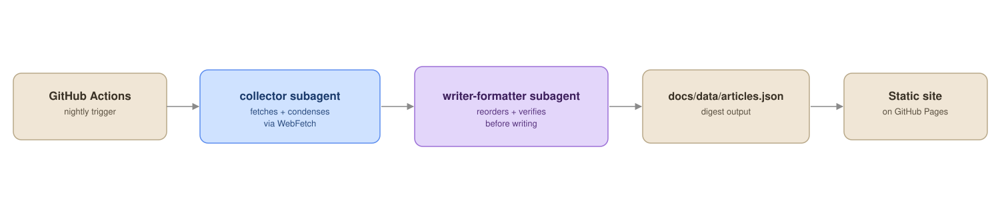
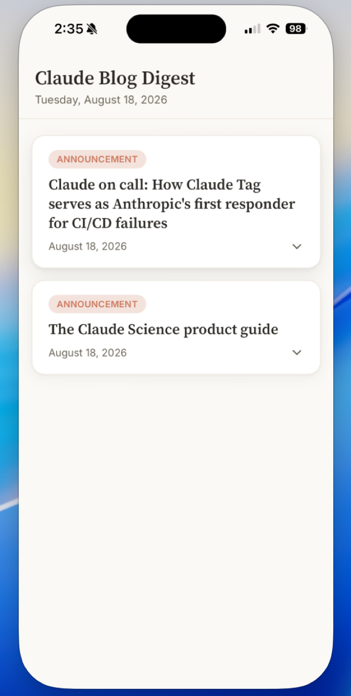
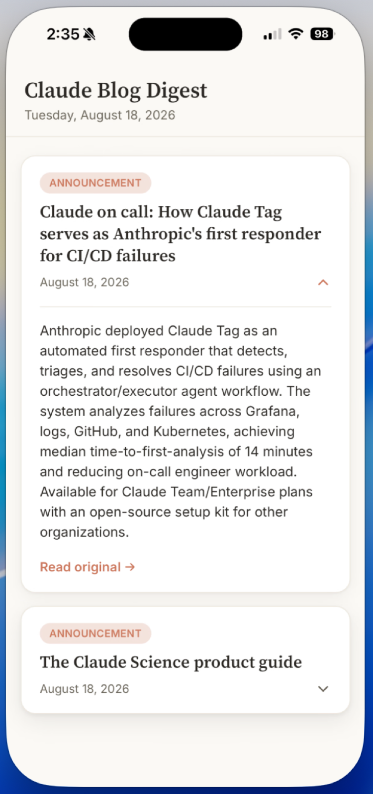

# Multi-Agent Blog Digest

An autonomous 2-agent Claude Code pipeline that produces a nightly digest of [claude.com/blog](https://claude.com/blog) posts, rendered as an iOS-installable web app.

## Architecture

## How it works

- **collector** — Fetches the day's articles from the Claude blog and condenses each one into short notes using `WebFetch`. This is the first step in the pipeline and gathers the raw source material.
- **writer-formatter** — Reads the collector's notes, reorders items by importance, tightens the wording, and verifies the output before writing the final digest to `docs/data/articles.json`.

The pipeline runs nightly via a GitHub Actions workflow. The resulting `docs/data/articles.json` is consumed by a static site hosted on GitHub Pages, which can be installed on iOS as a home-screen web app.

## Tech stack

- [Claude Code](https://claude.com/claude-code) — subagent orchestration (collector, writer-formatter)
- GitHub Actions — nightly scheduled trigger
- GitHub Pages — static site hosting
- Vanilla HTML/CSS/JS — no framework, iOS-installable web app

## Screenshots

<table>
<tr>
<td></td>
<td></td>
</tr>
</table>

Left: the daily digest card list. Right: an expanded card showing the
summary and source link.

## Setup / Local Development

1. Clone the repo.
2. Requirements: [Claude Code CLI](https://claude.com/claude-code) installed and authenticated (`claude setup-token`, or an API key).
3. Run the pipeline manually: open Claude Code in the repo root and run `Use collector, then use writer-formatter`.
4. Preview the site locally: `cd docs && python3 -m http.server 8765`, then open `localhost:8765`.
5. Deploy: push to `main` — GitHub Pages serves `docs/` automatically, and `nightly-digest.yml` runs the pipeline daily via GitHub Actions cron (or trigger manually from the Actions tab → `workflow_dispatch`).
