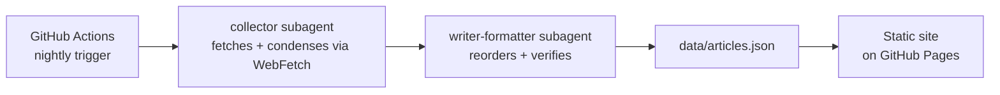

# Multi-Agent Blog Digest

An autonomous 2-agent Claude Code pipeline that produces a nightly digest of [claude.com/blog](https://claude.com/blog) posts, rendered as an iOS-installable web app.

## Architecture

## How it works

- **collector** — Fetches the day's articles from the Claude blog and condenses each one into short notes using `WebFetch`. This is the first step in the pipeline and gathers the raw source material.
- **writer-formatter** — Reads the collector's notes, reorders items by importance, tightens the wording, and verifies the output before writing the final digest to `data/articles.json`.

The pipeline runs nightly via a GitHub Actions workflow. The resulting `data/articles.json` is consumed by a static site hosted on GitHub Pages, which can be installed on iOS as a home-screen web app.

## Tech stack

- [Claude Code](https://claude.com/claude-code) — subagent orchestration (collector, writer-formatter)
- GitHub Actions — nightly scheduled trigger
- GitHub Pages — static site hosting
- Vanilla HTML/CSS/JS — no framework, iOS-installable web app

## Screenshots

<!-- app screenshots go here once the UI is built -->

## Setup / Local Development

TODO
